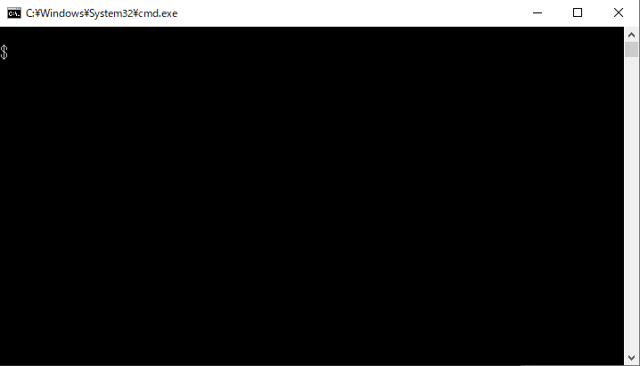

# tinygo-docker

tinygo-docker is helper for tinygo command with docker.

## Description

When executed as below,

```
tinygo-docker build -o app.uf2 -target pyportal .
```

you can get the same result as below.

```
docker run -it --rm \
-v $GOPATH/src/github.com/group/repo:/go/src/github.com/group/repo \
-w /go/src/github.com/group/repo \
-e GOPATH=/go \
tinygo/tinygo \
tinygo build -o app.uf2 -target pyportal .
```

## Demo



## Usage

Use tinygo-docker instead of tinygo.  

```
$ cd path/to/your/project
$ tinygo-docker build -o app.uf2 -target pyportal .
```

You can specify docker image / tag.  

```
$ tinygo-docker --docker-image tinygo/tinygo-dev build -o app.uf2 -target pyportal .
```

## Installation

```
go get github.com/sago35/tinygo-docker
```

### Environment

* Go 1.13
* Docker

## Author

sago35 - <sago35@gmail.com>
